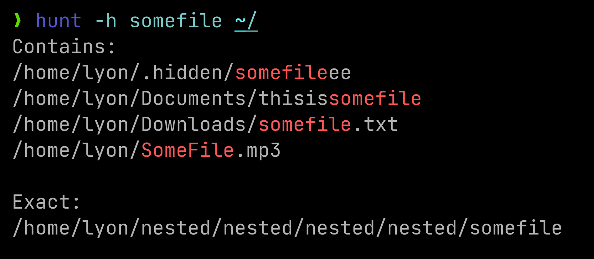

[](https://crates.io/crates/hunt)
[](https://github.com/LyonSyonII/hunt-rs/actions/workflows/publish.yml)  
**A *highly-opinionated* simplified Find command made with Rust.**  
By default it searches a file/folder in the working directory and divides the result between exact matches and ones that only contain the query.  
Results will be sorted alphabetically.

For example, `hunt SomeFile /` will search "SomeFile" from the root directory, and the output could be:
    
    Contains:
    /SomeFileIsHere
    /home/lyon/Downloads/abcdefgSomeFileeee
    /mnt/Files/--SomeFile--

    Exact:
    /home/lyon/SomeFile

Check the [Benchmarks](#benchmarks) for a comparison with other tools.
## Usage
    hunt [OPTIONS] [NAME] [SEARCH_IN_DIRS]...

By default, searches are case-insensitive, unless \<NAME> contains an uppercase letter or the -C flag is set.

### Options
    -c, --canonicalize
                   If enabled, all paths will be canonicalized.
    -C, --case-sensitive
                   If enabled, the search will be case-sensitive

                   Note that case-sensitivity will be activated automatically when the search query
                   contains an uppercase letter.

    -e, --exact    Only search for exactly matching occurrences, any file only 
                   containing the query will be skipped
            
                    e.g. if query is "SomeFile", "I'mSomeFile" will be skipped, 
                    as its name contains more letters than the search

    -f, --first    Stop when first occurrence is found

    -H, --hidden   If enabled, it searches inside hidden and ignored directories.

                   The list of ignored directories is:
                   "/proc", "/root", "/boot", "/dev", "/lib", "/lib64", 
                   "/lost+found", "/run", "/sbin", "/sys", "/tmp", "/var/tmp",
                   "/var/lib", "/var/log", "/var/db", "/var/cache", 
                   "/etc/pacman.d", "/etc/sudoers.d" and "/etc/audit"

    -i, --ignore <IGNORE_DIRS>
                   Search ignores this directories. The format is:
                   -i dir1,dir2,dir3,... (without spaces)

    -S, --starts <STARTS_WITH> 
                   Only files that start with this will be found
        
    -E, --ends   <ENDS_WITH>
                   Only files that end with this will be found

    -t, --type   <FILE_TYPE>
                   Specifies the type of the file
                   'f' -> file
                   'd' -> directory

    -v, --verbose  Print verbose output
                   It'll show all errors found: e.g. "Could not read /proc/81261/map_files"
    
    -s, --simple   Prints without formatting (without "Contains:" and "Exact:")
                   Useful for pairing it with other commands like xargs
    
    -ss            Same as -s, but without sorting the output


    -h  --help     Print help information
        
If the --first flag is set, the order in which the file will be searched is [current_dir, home_dir, root].  
If you're already in one of these directories, "current_dir" will be skipped.

If the --hidden flag is **not** set, hidden files/directories will be skipped, as well as: /proc, /root, /boot, /dev, /lib, /lib64, /lost+found, /run, /sbin, /sys, /tmp, /var/tmp, /var/lib, /var/log, /var/db, /var/cache, /etc/pacman.d, /etc/sudoers.d and /etc/audit

### Args
    <NAME>  Name of the file/folder to search
            By default, searches are case-insensitive, unless the query contains an uppercase letter.
    
    <LIMIT_TO_DIRS>...
            Directories where you want to search
            If provided, hunt will only search there
            
            These directories are treated independently, so if one is nested into another the
            search will be done two times:  
            
            e.g. "hunt somefile /home/user /home/user/downloads" will search in the home
            directory, and because /home/user/downloads is inside it, /downloads will be
            traversed two times

### Examples
* Search for a specific file on the whole system (hunt will stop once found)  
    
        hunt -f -e SomeFile

* Search for files containing "SomeFile"
    
        hunt SomeFile

* Search file in the home directory
    
        hunt -e SomeFile ~/

* Search file in the downloads and pictures directories
    
        hunt -e SomeFile ~/downloads ~/pictures

* Search all files that end with ".exe"
    
        hunt --ends .exe

* Search all files that end with ".exe" in the wine directory
    
        hunt --ends .exe ~/.wine

* Search all files that start with "." (all hidden files)
    
        hunt --starts .

* Search all files that end with ".exe", start with "M" and contain "wind" in the wine directory

        hunt --starts=M --ends=.exe wind ~/.wine

* Search a directory named "folder"
    
        hunt -t=d folder

* Search a file named "notfolder"
    
        hunt -t=f notfolder

* Remove all files named "SomeFile"
        
        hunt -s -e SomeFile | xargs rm -r

## Why I made it?
I found I used the `find` command just to search one file, so I wanted a simpler and faster option.

Hunt is multithreaded, so it's a lot faster than `find`, and more reliable than `locate` (recent files cannot be found with it).

## Installation
First check that you have [Rust](https://www.rust-lang.org/) installed, then run

    cargo install hunt

## Benchmarks
Let's compare Hunt with some of the most used tools: the [GNU **locate** and **find**](https://www.gnu.org/software/findutils/) and the very popular also written in rust, [**fd**](https://crates.io/crates/fd-find).

For benchmarking I'm using [hyperfine](https://github.com/sharkdp/hyperfine), a tool developed by the fd dev.  
These are done in a system with approximately 2,762,223 files, with a network drive and an external one.  
Results on other systems may vary, so take this comparisons as a guide.  


### Searching file in ~/
Find first occurrence of a heavily nested file in a hidden folder from the home directory.

```
Benchmark 1: hunt --hidden --first --exact SomeFile ~/
  Time (mean ± σ):      27.0 ms ±   7.1 ms    [User: 4.1 ms, System: 8.6 ms]
  Range (min … max):    12.0 ms …  46.2 ms    78 runs
 
Benchmark 2: fd --hidden --no-ignore --max-results 1 --color never SomeFile ~/
  Time (mean ± σ):     167.1 ms ±   8.8 ms    [User: 553.8 ms, System: 1119.9 ms]
  Range (min … max):   154.2 ms … 189.1 ms    17 runs
 
Benchmark 3: find ~/ -name SomeFile -print -quit
  Time (mean ± σ):      1.111 s ±  0.093 s    [User: 0.132 s, System: 0.397 s]
  Range (min … max):    1.060 s …  1.368 s    10 runs
 
Benchmark 4: locate -n 1 -A SomeFile
  Time (mean ± σ):     228.3 ms ±   1.7 ms    [User: 225.4 ms, System: 2.7 ms]
  Range (min … max):   226.8 ms … 232.5 ms    13 runs
 
Summary
  'hunt -h -f -e SomeFile ~/' ran
    6.19 ± 1.66 times faster than 'fd -HI --max-results 1 -c never SomeFile ~/'
    8.45 ± 2.22 times faster than 'locate -n 1 -A SomeFile'
   41.17 ± 11.36 times faster than 'find ~/ -name SomeFile -print -quit'
```

#### Hunt
--hidden, search all files (it normally ignores hidden files and directories in the [Ignore List](#options)).  
--first, stop when first occurrence is found.  
--exact, only search for files/folders named "SomeFile", names that only contain the pattern will be skipped.  

```
Benchmark 1: hunt --hidden --first --exact SomeFile ~/
  Time (mean ± σ):      27.0 ms ±   7.1 ms    [User: 4.1 ms, System: 8.6 ms]
  Range (min … max):    12.0 ms …  46.2 ms    78 runs
```

#### Fd
```
Benchmark 2: fd --hidden --no-ignore --max-results 1 --color never SomeFile ~/
  Time (mean ± σ):     167.1 ms ±   8.8 ms    [User: 553.8 ms, System: 1119.9 ms]
  Range (min … max):   154.2 ms … 189.1 ms    17 runs
```

#### Find
```
Benchmark 3: find ~/ -name SomeFile -print -quit
  Time (mean ± σ):      1.111 s ±  0.093 s    [User: 0.132 s, System: 0.397 s]
  Range (min … max):    1.060 s …  1.368 s    10 runs
```

#### Locate
```
Benchmark 4: locate -n 1 -A SomeFile
  Time (mean ± σ):     228.3 ms ±   1.7 ms    [User: 225.4 ms, System: 2.7 ms]
  Range (min … max):   226.8 ms … 232.5 ms    13 runs
```

#### Summary
```
'hunt -h -f -e SomeFile ~/' ran
   6.19 ± 1.66 times faster than 'fd -HI --max-results 1 -c never SomeFile ~/'
   8.45 ± 2.22 times faster than 'locate -n 1 -A SomeFile'
  41.17 ± 11.36 times faster than 'find ~/ -name SomeFile -print -quit'
```

### Searching all files that contain "SomeFile"
Find all occurrences of "SomeFile" from the root directory (worst case scenario, checking all files in the system). 

The occurrences in question are:  
```
/home/lyon/Downloads/abcdefgSomeFileeee
/SomeFileIsHere
/mnt/Files/--SomeFile--
/home/lyon/.wine/drive_c/Program Files (x86)/Internet Explorer/SomeFile
```

For this benchmark I'll skip Locate. It's obviously faster because it doesn't traverse all the filesystem, as it is backed up by a database.  
It must be noted though that the file in /mnt/Files was not found, as the database does not keep record of files in other drives.  
For the curious, it scored a time of 486.8 ms, only 1.32 times faster than Hunt.

#### Hunt
```
Benchmark 1: hunt -h SomeFile /
  Time (mean ± σ):     633.6 ms ±  25.1 ms    [User: 2876.7 ms, System: 2507.5 ms]
  Range (min … max):   589.4 ms … 671.2 ms    10 runs
```

#### Fd
```
Benchmark 2: fd -HI -c never SomeFile /
  Time (mean ± σ):      1.452 s ±  0.014 s    [User: 4.116 s, System: 8.693 s]
  Range (min … max):    1.431 s …  1.474 s    10 runs
```

#### Find
```
Benchmark 3: find / -name "*SomeFile*"
  Time (mean ± σ):      3.473 s ±  0.144 s    [User: 1.234 s, System: 1.602 s]
  Range (min … max):    3.374 s …  3.874 s    10 runs

```

#### Summary
```
'hunt -h SomeFile /' ran
  2.29 ± 0.09 times faster than 'fd -HI -c never SomeFile /'
  5.48 ± 0.31 times faster than 'find / -name "*SomeFile*"'
```

### Conclusion
Hunt is faster than other alternatives if you don't need a lot of features (like regex).  
Think of it as a simple "where did I put that file?" solution.
